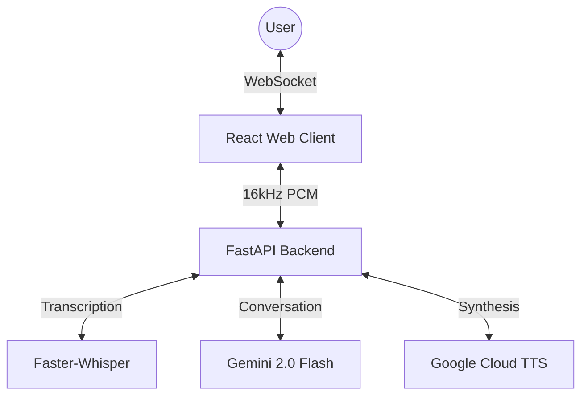

# NeuroVoice

**NeuroVoice** is a high-performance, real-time voice-to-voice conversation platform. It enables seamless human-like interactions with AI using cutting-edge streaming technologies and a premium interactive interface.

## 🚀 Key Features

- **Real-time Continuous Streaming**: Bidirectional binary communication via WebSockets (Low-latency).
- **Premium Web Client**: Glassmorphic UI with dynamic volume visualizations and real-time transcriptions.
- **High-Performance Audio Engine**: Custom `AudioWorklet` for off-main-thread 16kHz PCM resampling.
- **Local STT**: Powered by `faster-whisper` for ultra-fast, private transcription.
- **Advanced AI Brain**: Integrated with Google Gemini via Vertex AI.
- **Streaming TTS**: Real-time speech synthesis with chunked delivery for near-instant playback.

## 🏗️ Architecture

NeuroVoice is built as a modular monorepo, separating the high-performance backend from the modern, responsive web client.



### Directory Structure
```text
.
├── backend/            # FastAPI asynchronous server
│   ├── src/
│   │   ├── api/        # WebSocket & REST routes
│   │   ├── core/       # Config, Logging, Security
│   │   ├── services/   # STT, Agent, TTS, Audio Utils
│   └── docs/           # API documentation
├── frontend/           # Vite + React + TypeScript web client
│   ├── src/
│   │   ├── components/ # VolumeOrb, ChatInterface, ControlButton
│   │   ├── hooks/      # useNeuroVoice core logic
│   │   ├── workers/    # AudioWorklet (DSP)
│   │   └── index.css   # Tailwind CSS v4 design system
└── specs/              # SDD (Specification Driven Development) artifacts
```

## 🛠️ Getting Started

### Backend Setup

1. **Install dependencies**:
   ```bash
   cd backend
   python3 -m venv .venv
   source .venv/bin/activate
   pip install -r requirements.txt
   ```

2. **Configure Environment**:
   Create a `backend/.env` file:
   ```env
   GOOGLE_PROJECT_ID=your-project-id
   WHISPER_MODEL_NAME=base
   GEMINI_MODEL_ID=gemini-2.0-flash-001
   ```

3. **Run Server**:
   ```bash
   python -m uvicorn src.main:app --reload
   ```

### Frontend Setup

1. **Install dependencies**:
   ```bash
   cd frontend
   npm install
   ```

2. **Run Dev Server**:
   ```bash
   npm run dev
   ```
   The client will be available at [http://localhost:5173](http://localhost:5173).

## 📡 Communication Protocol (Binary WebSocket)

NeuroVoice uses a specialized binary-first protocol for minimum latency:

1. **Client -> Server**: Continuous stream of **16,000Hz 16-bit Mono PCM** audio chunks.
2. **Server -> Client (Metadata)**: JSON messages for:
   - `volume`: Real-time feedback for visualization.
   - `transcription`: Intermediate/Final STT results.
   - `ai_text`: Streaming AI text response.
3. **Server -> Client (Audio)**: AI voice response delivered in 16kHz PCM binary chunks.

## 📅 Roadmap

- [x] **Phase 1**: Backend Foundation (FastAPI, WebSockets, STT/Agent/TTS Core)
- [x] **Phase 2**: Web Client (Vite + React, Tailwind v4, AudioWorklet DSP)
- [ ] **Phase 3**: iOS App (Native Swift Implementation)
- [ ] **Phase 4**: Advanced Agents (MCP Integration + Tool Use)

## 📜 License

MIT License - see [LICENSE](LICENSE) for details.
